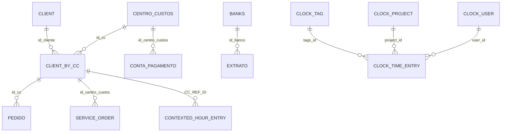

# Mapeamento de Acessos e Relacoes de Banco

Sim, e possivel mapear com boa precisao a partir do codigo atual. Este documento consolida:
- relacoes fisicas (FKs e `relationship` do SQLAlchemy);
- relacoes logicas (joins por campo sem FK formal);
- acessos por modulo/rota (leitura, escrita, sincronizacao).

## 1) Relacoes Fisicas (FK reais)

### Dominio Comercial/Financeiro
- `client_by_cc.id_cc -> centro_custos.id_centro_custos`
- `client_by_cc.id_cliente -> client.id_cliente`
- `pedido.id_cc -> client_by_cc.CC`
- `service_order.id_centro_custos -> client_by_cc.CC`
- `contexted_hour_entry.CC_REF_ID -> client_by_cc.CC`
- `conta_pagamento.id_centro_custos -> centro_custos.id_centro_custos`
- `extrato.id_banco -> banks.id_banco_cad`

### Dominio Clockify
- `clock_time_entry.user_id -> clock_user.id`
- `clock_time_entry.project_id -> clock_project.id`
- `clock_time_entry.tags_id -> clock_tag.id`

## 2) Relacoes ORM (`back_populates`)
- `CentroCustos <-> Client_by_CC`
- `CentroCustos <-> ContaPagamento`
- `Client <-> Client_by_CC`
- `Client_by_CC <-> Pedido`
- `Client_by_CC <-> ServiceOrder`
- `Client_by_CC <-> Contexted_hour_entry`
- `Banks <-> Extrato`
- `Clock_User <-> Clock_Time_Entry`
- `Clock_Project <-> Clock_Time_Entry`
- `Clock_tag <-> Clock_Time_Entry`

## 3) Relacoes Logicas (sem FK no schema)
Estas relacoes existem no codigo, mas nao estao amarradas por FK:
- `Clock_Project.client_id` referenciando cliente Clockify (na pratica, `Clock_Client.id`).
- Integracao OS/Pedido/CC por parsing de texto (`obs_interno_pedido`, `referencia_pedido`) para obter `CC`.
- Cruzamentos de RH e ponto por CPF/email entre:
  - `EmployersData`
  - `Tangerino_entries`
  - `Clock_User` / `Clock_Time_Entry`
  - resultado em `Current_worked_hours`.
- Consolidacao em `OrdersManage` usando `Pedido` + `ServiceOrder` + `CentroCustos` + `Client_by_CC`.

## 4) Mapa de Acesso por Modulo

### Rotas HTTP (camada `routes/`)
- Leitura com paginacao/consulta:
  - `Client`, `CentroCustos`, `ServiceOrder`, `Extrato`, `Clock_User`.
- Exportacao CSV:
  - `Client`, `CentroCustos`, `ServiceOrder`, `Extrato`, `Pedido`, `Buy_order`, `Clock_*`, `PrimaData`.
- Escrita direta (POST/PUT de cadastro/manual):
  - `Client`, `CentroCustos`, `ServiceOrder`, `Extrato`, `Pedido`, `Clock_User`, `Clock_Time_Entry`, `PrimaData`, `Client_by_CC`, `Valor_base_by_cargo`, `User_by_name`, `Indice_ano`, `Colaborador_cargo_value`.
- Orquestracao de status de atualizacao:
  - `Update_route_status`.

### Providers VHSYS (`VHSYS/`)
- `vhsys_client.py` -> `Client`
- `vhsys_cost_center.py` -> `CentroCustos`, `Client_by_CC`
- `vhsys_requests.py` -> `Pedido`
- `vhsys_service_order.py` -> `ServiceOrder` (+ consulta `CentroCustos`, `Client_by_CC`, `Extrato`)
- `vhsys_extract.py` -> `Extrato`
- `vhsys_contas.py` -> `ContaPagamento`
- `vhsys_contas_receber.py` -> `ContaReceber`
- `vhsys_banks.py` -> `Banks`
- `vhsys_categorias.py` -> `Categoria_financeira`
- `vhsys_buy_order.py` -> `Buy_order`
- `vhsys_nf.py` -> `NF`
- `vhsys_merchandises_entry.py` -> `Merch_entry`
- `vhsys_product.py` -> `Product`
- `vhsys_products_entry.py` -> `Product_entry` (+ leitura `Merch_entry`)

### Providers Clockify (`clockfy/`)
- `clockfy_user.py` -> `Clock_User`
- `clockfy_app_client.py` -> `Clock_Client`
- `clockfy_project.py` -> `Clock_Project`
- `clockfy_tags.py` -> `Clock_tag`
- `clockfy_hour_entry_new.py` -> `Clock_Time_Entry` (+ suporte `Clock_Project`, `Clock_tag`, `Clock_User`)
- `new_clockfy_hour_contexted.py` / `prima_hour_contexted.py` -> `Contexted_hour_entry` (+ `PrimaData`, `Client_by_CC`, `Indice_ano`, `Valor_base_by_cargo`, `Colaborador_cargo_value`)

### Tangerino e Auxiliares
- `tangerino_time_entry.py` -> `Current_worked_hours` (leitura de `Tangerino_entries`, `EmployersData`, `Clock_User`, `Clock_Time_Entry`)
- `auxiliar_data/hh_value.py` -> `Valor_base_by_employer` (leitura de `EmployersData`)

### Managers / Controle
- `utils/orders_manager.py` -> `OrdersManage` (leitura de `Pedido`, `ServiceOrder`, `CentroCustos`)
- `utils/update_cc_by_client.py` -> `Client_by_CC` (leitura de `CentroCustos`, `Client`, `OrdersManage`)
- `utils/update_manage/update_manager.py` -> `Update_route_status`

## 5) ER simplificado (Mermaid)

## 6) Observacoes tecnicas
- O projeto mistura relacoes fortes (FK) com relacoes por convencao de texto/chaves derivadas.
- Existem tabelas espelho/consolidacao (`OrdersManage`, `Current_worked_hours`) para analytics operacional.
- Ha inconsistencias pontuais de modelo x uso em rotas/servicos; para governanca de dados, o ideal e formalizar:
  - dicionario de dados por tabela;
  - constraints/indices adicionais;
  - validacao de integridade referencial para relacoes hoje apenas logicas.
