# ER Completo (Auditoria)

Este diagrama cobre **todas as tabelas/modelos** identificadas em `models.py`.

## Premissas de auditoria
- Relacoes **fisicas**: somente as que possuem `ForeignKey(...)` explicita.
- Relacoes **logicas**: inferidas do codigo (joins por chave de negocio, sem constraint no schema).
- Para classes sem `__tablename__` explicita, o nome de tabela abaixo esta **inferido** por convencao do SQLAlchemy/Flask-SQLAlchemy.

## Inventario completo de entidades
- Explicitas em `__tablename__`: `centro_custos`, `pedido`, `extrato`, `conta_pagamento`, `conta_receber`, `service_order`, `client`, `clock_user`, `clock_client`, `clock_project`, `clock_tag`, `clock_time_entry`, `prima_data`, `contexted_hour_entry`, `client_by_cc`, `buy_order`, `banks`, `indice_ano`, `orders_manage`, `employers`, `employersData`, `employersDependents`, `employersBenefits`, `employersPosition`, `coustEntryByCC`, `salesNFReport`, `serviceNFReport`, `TangerinoEntries`, `merch_entry`, `product_entry`, `products`.
- Inferidas (sem `__tablename__` no arquivo): `despesas_recorrentes`, `relatorio_cc`, `user_by_name`, `valor_base_by_cargo`, `valor_base_by_employer`, `categoria_financeira`, `colaborador_cargo_value`, `update_route_status`, `update_cc_report_status`, `update_extension_services`, `nf_servicemetadata`, `nf_service`, `nf`, `tangerino_entries`, `current_worked_hours`.

## Diagrama ER (Completo)

```mermaid
erDiagram
  centro_custos {
    text id_centro_custos PK
    text ref_centro_custos
    text desc_centro_custos
  }
  despesas_recorrentes {
    text id_custo PK
    text id_empresa
  }
  pedido {
    text id_ped PK
    text id_pedido
    text id_cc FK
  }
  extrato {
    int id_local PK
    int id_fluxo UK
    int id_banco FK
  }
  conta_pagamento {
    text id_conta_pag PK
    text id_centro_custos FK
  }
  conta_receber {
    text id_conta_rec PK
  }
  service_order {
    text id_ordem PK
    text id_centro_custos FK
  }
  client {
    text id_cliente PK
  }
  clock_user {
    text id PK
  }
  clock_client {
    text id PK
  }
  clock_project {
    text id PK
    text client_id
  }
  clock_tag {
    text id PK
  }
  clock_time_entry {
    text id PK
    text user_id FK
    text project_id FK
    text tags_id FK
  }
  prima_data {
    int id_local PK
    text ID UK
  }
  contexted_hour_entry {
    text TOKEN PK
    text CC_REF_ID FK
    text ORIGEM_ID UK
  }
  relatorio_cc {
    text ID PK
  }
  client_by_cc {
    text CC PK
    text id_cc FK
    text id_cliente FK
  }
  buy_order {
    int id_local PK
    int id_ordem UK
  }
  user_by_name {
    int id_local PK
    text user UK
  }
  valor_base_by_cargo {
    int id_local PK
    text cargo UK
  }
  valor_base_by_employer {
    int id_matricula PK
    text employer UK
  }
  categoria_financeira {
    int id_categoria PK
  }
  colaborador_cargo_value {
    int id_local PK
    int cargo_id
  }
  update_route_status {
    text route PK
  }
  update_cc_report_status {
    text cc_id PK
  }
  banks {
    int id_banco_cad PK
  }
  indice_ano {
    int id_ano PK
  }
  orders_manage {
    text ID PK
    text id_origem
  }
  employers {
    int vhsys_id PK
  }
  employersData {
    text id_funcionario PK
  }
  employersDependents {
    text dependents_id PK
  }
  employersBenefits {
    text benefit_id PK
    text id_funcionario PK
  }
  employersPosition {
    text position_id PK
  }
  coustEntryByCC {
    text coustEntryByCC_id PK
  }
  salesNFReport {
    text Nota PK
  }
  serviceNFReport {
    text RPS PK
  }
  TangerinoEntries {
    text ID PK
  }
  update_extension_services {
    text ACTION PK
  }
  nf_servicemetadata {
    text codigo PK
  }
  nf_service {
    text id_servico PK
  }
  nf {
    text id_venda PK
  }
  tangerino_entries {
    text ID PK
  }
  current_worked_hours {
    text ID PK
  }
  merch_entry {
    text id_entrada PK
  }
  product_entry {
    text id_ped_produto PK
    text id_entrada
    text id_produto
  }
  products {
    text id_produto PK
  }

  %% Relacoes fisicas (FK no schema)
  client_by_cc ||--o{ pedido : "CC <- id_cc"
  banks ||--o{ extrato : "id_banco_cad <- id_banco"
  centro_custos ||--o{ conta_pagamento : "id_centro_custos"
  client_by_cc ||--o{ service_order : "CC <- id_centro_custos"
  clock_user ||--o{ clock_time_entry : "id <- user_id"
  clock_project ||--o{ clock_time_entry : "id <- project_id"
  clock_tag ||--o{ clock_time_entry : "id <- tags_id"
  client_by_cc ||--o{ contexted_hour_entry : "CC <- CC_REF_ID"
  centro_custos ||--o{ client_by_cc : "id_centro_custos <- id_cc"
  client ||--o{ client_by_cc : "id_cliente"

  %% Relacoes logicas relevantes (sem FK)
  client ||..o{ service_order : "id_cliente (logico)"
  client ||..o{ pedido : "id_cliente (logico)"
  centro_custos ||..o{ extrato : "id_centro_custos (logico)"
  client_by_cc ||..o{ orders_manage : "id_cc_by_client/ref_cc"
  pedido ||..o{ orders_manage : "id_origem/type=OV"
  service_order ||..o{ orders_manage : "id_origem/type=OS"
  products ||..o{ product_entry : "id_produto (logico)"
  merch_entry ||..o{ product_entry : "id_entrada (logico)"
  prima_data ||..o{ contexted_hour_entry : "ORIGEM=PRIMA (logico)"
  clock_time_entry ||..o{ contexted_hour_entry : "ORIGEM=CLOCK (logico)"
  valor_base_by_cargo ||..o{ colaborador_cargo_value : "cargo_id (logico)"
  indice_ano ||..o{ contexted_hour_entry : "ANO/FATOR_ANO (logico)"
  employersData ||..o{ valor_base_by_employer : "id_matricula/employer (logico)"
  employersData ||..o{ current_worked_hours : "email/cpf (logico)"
  tangerino_entries ||..o{ current_worked_hours : "DAY_REF/EMPLOYER (logico)"
  clock_user ||..o{ current_worked_hours : "email_CLOCK (logico)"
  clock_time_entry ||..o{ current_worked_hours : "day_reference_CLOCK (logico)"
  nf ||..o{ nf_service : "id_pedido/id_cliente (logico)"
  nf_servicemetadata ||..o{ nf_service : "codigo/nota (logico)"
  nf ||..o{ salesNFReport : "Nota/id_venda (logico)"
  nf_service ||..o{ serviceNFReport : "RPS/id_servico (logico)"
```

## Mapa de cardinalidades auditaveis (fisicas)
- `centro_custos 1:N client_by_cc`
- `client 1:N client_by_cc`
- `client_by_cc 1:N pedido`
- `client_by_cc 1:N service_order`
- `client_by_cc 1:N contexted_hour_entry`
- `banks 1:N extrato`
- `centro_custos 1:N conta_pagamento`
- `clock_user 1:N clock_time_entry`
- `clock_project 1:N clock_time_entry`
- `clock_tag 1:N clock_time_entry`

## Observacoes para auditoria
- O modelo mistura entidades operacionais (fonte), consolidadas (`orders_manage`, `current_worked_hours`) e de controle (`update_*`).
- Boa parte das integracoes usa relacionamento logico por chave textual, sem FK.
- Para auditoria forte, recomenda-se validação SQL periódica de orfãos e chaves divergentes.
