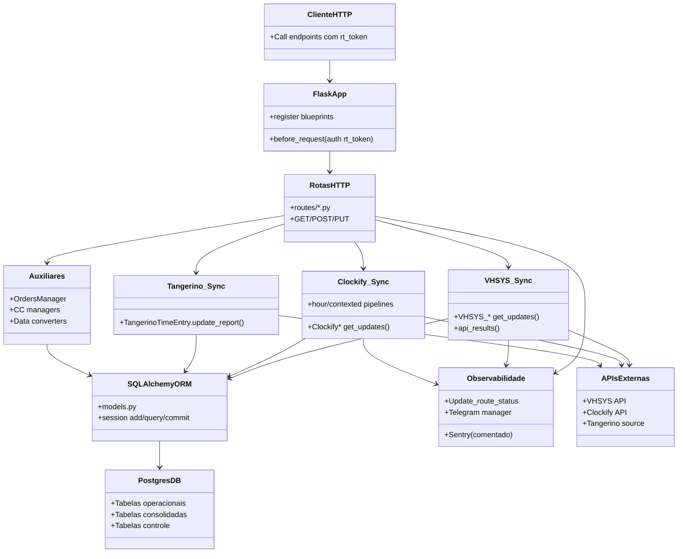
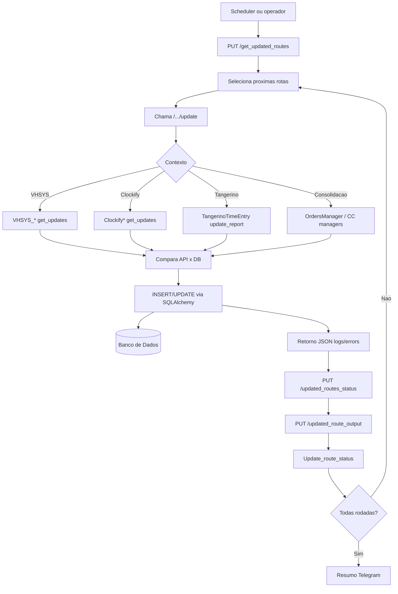

# UML de Macroarquitetura (Fluxo Completo)

Este diagrama resume os **contextos funcionais** do sistema e os fluxos entre API, sincronizadores, banco e observabilidade.

## 1) UML de Componentes (macroarquitetura)

## 2) UML de Fluxo Operacional (pipeline de atualizacao)

## 3) Contextos mapeados
- Contexto API/Web: `app.py`, `routes/*`
- Contexto Integracao VHSYS: `VHSYS/*`
- Contexto Integracao Clockify: `clockfy/*`
- Contexto Integracao Tangerino: `tangerino/*`
- Contexto RH/Auxiliar: `auxiliar_data/*`
- Contexto Consolidacao/Business: `utils/orders_manager.py`, `utils/update_cc_by_client.py`
- Contexto Controle de Execucao: `utils/update_manage/*`, tabela `Update_route_status`
- Contexto Persistencia: `models.py` + SQLAlchemy

## 4) Estados de dados na macroarquitetura
- Fonte externa: APIs VHSYS/Clockify + dataset Tangerino.
- Staging/espelho local: tabelas de dominio (`pedido`, `service_order`, `clock_*`, etc.).
- Camada consolidada: `orders_manage`, `current_worked_hours`, visoes/relatorios.
- Controle operacional: `update_route_status`, `update_cc_report_status`.
